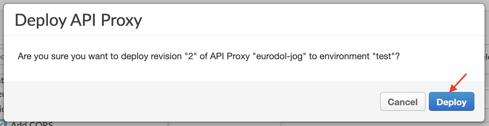
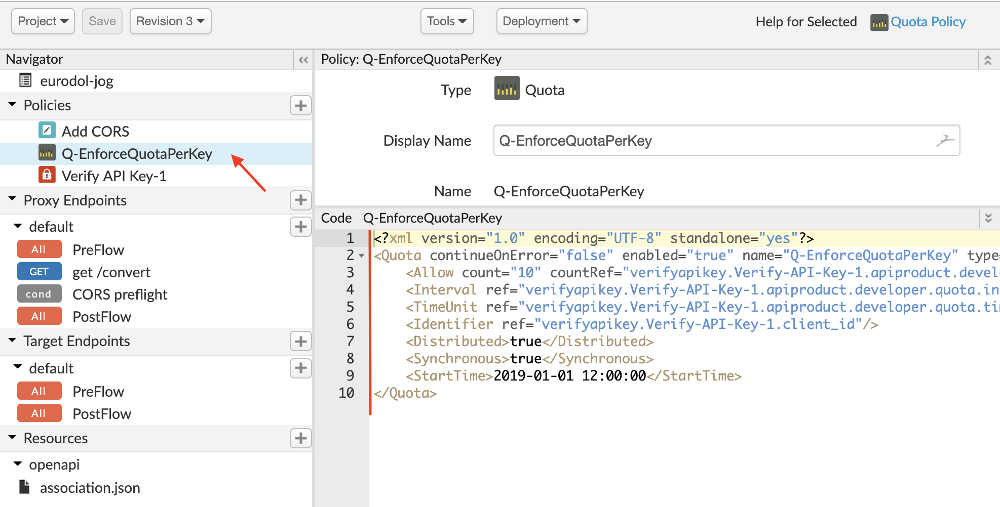
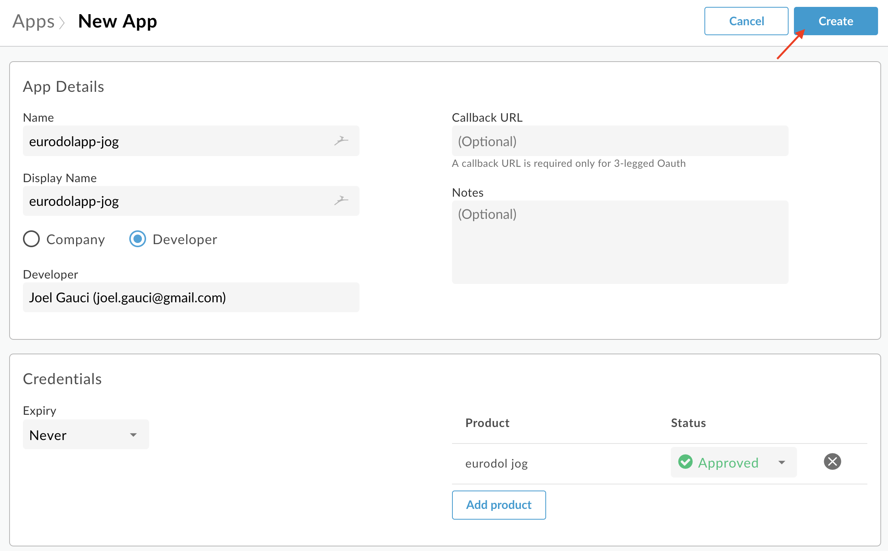
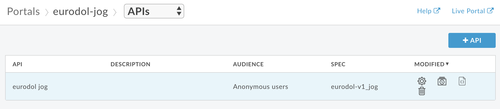
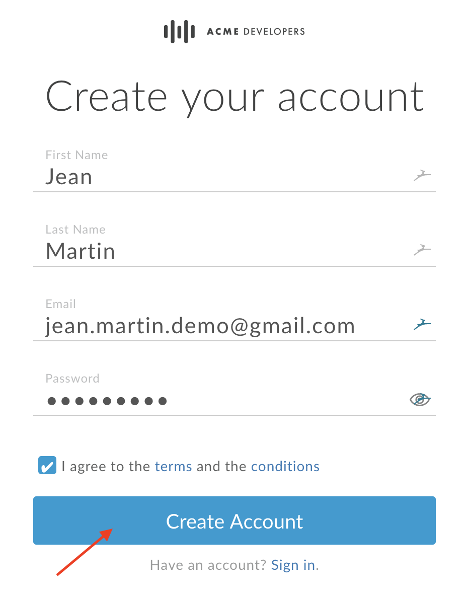
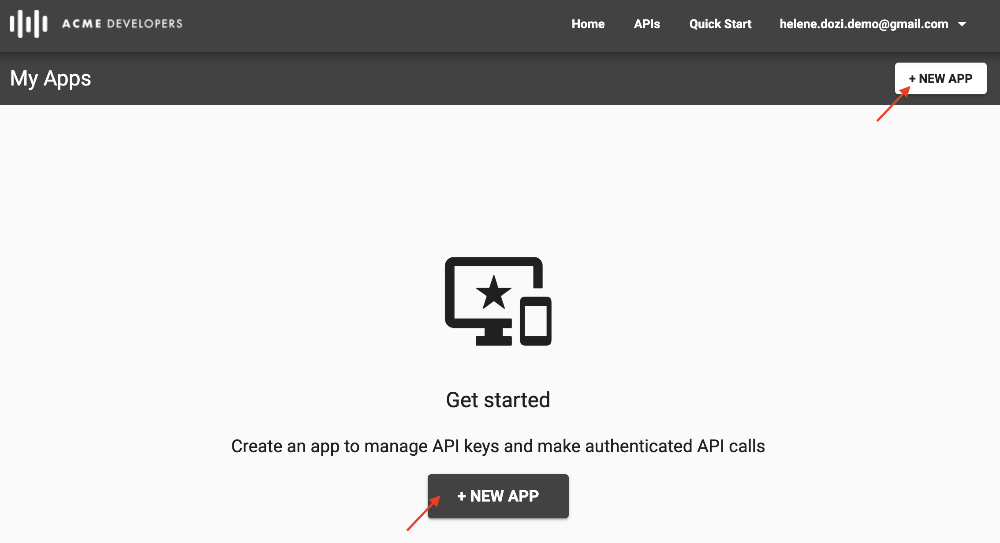
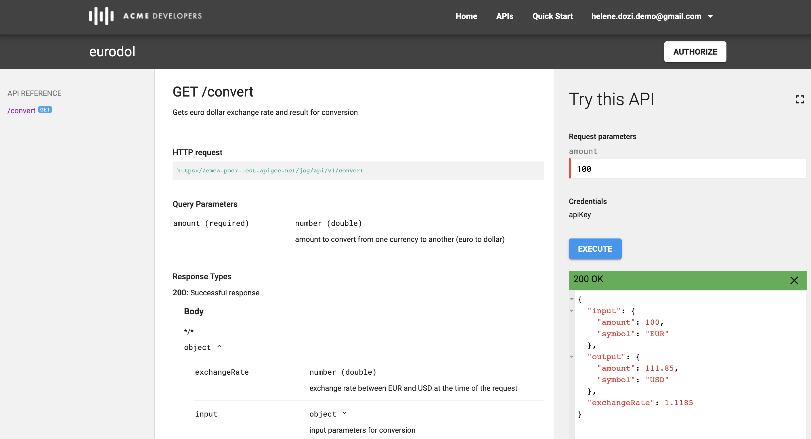

<div style="background-color:#5A0F1B;color:white; vertical-align: middle; text-align:center;font-size:190%; padding:10px; margin-top:100px">
 Workshop Pivotal Cloud Foundry & Google Apigee 
</div>

---
# Technical Workshop Pivotal Cloud Foundry & Google Apigee


## Goal of this material
This material has been created for Pivotal Cloud Foundry (PCF) and Google Apigee workshops.
**It consists in technical labs**, which will guide you in order to make you discover a typical usage of the 2 solutions.
The use case you will work on is called **"JAG"**: Just Another Gateway.
In order to understand this use case, we have created a step-by-step lab.
At this point of the workshop, please be sure instructors have provided the following topics:
    - access to an Apigee Edge demo organization, which is the Apigee Edge (SaaS) tenant you will work on. 
    - access to an PCF demo account, which is the place to create your Euro-Dollar application.

The Euro-Dollar application (aka **eurodol**) is a simple Java application that is able to convert currencies: Euro into Dollar and vice versa. 
Let's get started, and feel free to ask for any questions during the completion of the lab.

# Table of Content

PCF & Google Apigee Workshop

1. Step 1 - Deploy an app to the Cloud using PCF
    - 1.1 Create your PCF account
    - 1.2 Deploy the **eurodol** application
    - 1.3 Test the **eurodol** application
2. Step 2 - API Creation on the Apigee Edge SaaS platform
    - 2.1 Connect to your Apigee organization
    - 2.2 Upload the OpenAPI **eurodol-v1** specification
    - 2.3 Create an API Proxy, based on your OpenAPI **eurodol-v1** specification
    - 2.4 Modify the configuration of your API Proxy
3. Step 3 - Test your API Proxy using the Trace & Debug tool
    - 3.1 Add Traffic Management (**Quota Enforcement**) and Security (**Verify API Key**) policies to your API Proxy
4. Step 4 - Package your API Proxy into an API Product in Apigee Edge
    - 4.1 Create a developer
    - 4.2 Create an application
    - 4.3 Create an **API Product** 
5. Step 5 - Create your own API Developer Portal
    - 5.1 Instanciate a Developer Portal from your Apigee Edge organization
6. Step 6 - Publish your API Product into your API Developer Portal
    - 6.1 Publish your eurodol API Product
    - 6.2 Generate doc using the OpenAPI **eurodol-v1** specification
7. Step 7 - Test your API Product from the Developer Portal
    - 7.1 Connect to your Developer Portal
    - 7.2 Create an account an your Developer Portal
    - 7.3 Activate your account and sign in
    - 7.4 Create an Application on your Developer Portal
    - 7.5 Subscribe to the **eurodol** API Product
    - 7.6 Test your API Product
    - 7.7 Verify the Quota Enforcement is enforced
8. Step 8 - Wire PCF and Apigee
9. Step 9 - Analytics and API Monitoring in Apigee Edge
10. Step 10 - Wrap Up

    Appendix A. Apigee Edge Resources

    - 4 minute video 4 developers
    - Apigee docs
    - Apigee community

    Appendix B. Pivotal Cloud Foundry Resources


# Step 1

In this lab, we use an hosted Pivotal Cloud Foundry instance:
[Pivotal Web Services](https://run.pivotal.io). This instance
offers free credit to push apps to the Cloud: it's a great way
to discover the `cf push` experience.


## Step 1.1 - Create your PCF account

Go to https://run.pivotal.io, and
[create a free account](https://try.run.pivotal.io/homepage)
from the login page.

Sign-in using your account, and go to the
[Tools section](https://console.run.pivotal.io/tools).

Download the `cf` CLI tool from this page.
Follow instructions to login using the `cf` CLI tool:


## Step 1.2 - Deploy the **eurodol** application

[Eurodol](https://github.com/alexandreroman/eurodol)
is a Cloud-native app, leveraging Spring Boot,
Spring Cloud & Vue.js. Using your PCF account, you're about to
push this app to the Cloud in no time.


From the [releases tab](https://github.com/alexandreroman/eurodol/releases),
download the latest version of the app.
You need to get the JAR file (`eurodol-X.jar`) and the
Cloud Foundry manifest (`manifest.yml`).

Now that you have the files on your workstation, open a terminal
and enter this command:
```bash
$ cf push --random-route
```

Your JAR file will be uploaded to Cloud Foundry: the platform will
take care of creating a container for you with all required
dependencies (Java Runtime Environment, Spring Boot support,
memory settings, etc.). You will end up with a domain registered for
your app instance: something like `eurodol-RANDOM-WORDS.cfapps.io`.

## Step 1.3 - Test the **eurodol** application

Your app is now up and running thanks to Cloud Foundry.
Using the public app endpoint, you're about to check if the app is
working as expected.

Get the public app endpoint using this command:
```bash
$ cf app eurodol
Showing health and status for app eurodol-test in org EMEA / space aroman as aroman@pivotal.io...

name:              eurodol
requested state:   started
routes:            eurodol-terrific-nyala.cfapps.io
last uploaded:     Mon 03 Jun 13:36:54 CEST 2019
stack:             cflinuxfs3
buildpacks:        client-certificate-mapper=1.8.0_RELEASE container-security-provider=1.16.0_RELEASE
                   java-buildpack=v4.19-offline-https://github.com/cloudfoundry/java-buildpack.git#3f4eee2 java-main java-opts java-security jvmkill-agent=1.16.0_RELEASE
                   open-jdk-...

type:           web
instances:      1/1
memory usage:   1024M
     state     since                  cpu    memory         disk           details
#0   running   2019-06-03T11:37:15Z   0.5%   175.3M of 1G   134.3M of 1G
```

Look at section `routes`: this is how you can reach your app using a
browser. Hit this URL, and you should be able to access the app.

# Step 2 - API Creation on the Apigee Edge SaaS platform

In this section, you connect to the Apigee Edge platform using your own account. After a quick introduction to the Apigee platform and main tabs, you start creating your first API Proxy and set its configuration.

## Step 2.1 - Connect to your Apigee organization
Before starting this lab, instructors have created an Apigee Edge (SaaS) demo account for each participant.
Accounts have been created with your email addresses. 
As a participant, please connect to your email inbox and activate your demo account, if not completed yet.

At this point, you should be able to access the Apigee Edge login screen, as shown here:


Once you are connected, you should be able to see the Apigee Edge home page, note that you work in the **emea-poc7** organization, as shown on the following picture:


Here is an overview of the Apigee Edge home page:


Also note that you are working with an __Organization Admninistrator__ role.

As, you can see, the home page consists in several icons:
- Specs : this is the place where you upload all your OpenAPI specification files. Then you can use these files to create API Proxies
- API Proxies : at this point, just consider an API Proxy as an "API Façade", on which you can add technical controls, in the form of mediation, traffic management, security policies as well as extensions.
- API Products : an API Product is a way to package a set of API Proxies. It can be used to define quotas, custom attributes, OAuth20 scopes and some other specific properties: visibility on the Developer Portal, approval mecahnism for application subscription...
- Portals : once you have created API Products, you can make them available through a Developer Portal

We have just covered here some aspects of an API life cycle...from the Design to the publication of product on a Developer Portal !

## Step 2.2 -  Upload the OpenAPI eurodol-v1 specification

Click on the **Specs** icon, or access the **specs** tab, as shown here:


Click the **+Spec** button on the right and top side of the panel, as shown on the image, then select **Import URL...** :


As **Import Name**, please enter a name of your convenience. Please be aware that this organization is also used by the other participants so you have to find a way to make the name of your file unique! Be creative, for instance you can add your initials to the name of the file: **eurodol-v1_YOUR-INITIALS** (eurodol-v1_jog in my case)

As **Import Url**, please copy and paste the following value: https://raw.githubusercontent.com/JoelGauci/pcf-apigee/master/apigee/specs/eurodol-v1.yaml

This points to the OpenAPI specification we use in this workshop. You can have a look at the specification if you click on the following link:

[eurodol-v1 OpenAPI specification](https://raw.githubusercontent.com/JoelGauci/pcf-apigee/master/apigee/specs/eurodol-v1.yaml)

Before clicking the **Import** button, you should check you get the following info (except the initials...), as shown on the picture: 


You can now click the **Import** button to import the OpenAPI specification into the orgqnization.

From the Specs list, find your **eurodol-v1** personal specification and click on it, as shown on the following picture:


This will show the content of your **eurodol-v1** specification, as shown here after:


Important: you have to make a modification on this file...See the **{YOUR_PERSONAL_CODE}** pattern in the file...you should find it around line 16...


...modify the pattern with your own initials or a pattern of your convenience (do not include any special characters).
Please take note of these initials as you will have to use them later in the workshop.

```code
/{YOUR_PERSONAL_CODE}/api/v1
```

becomes

```code
/jog/api/v1
```

Here is an example of the result in my case, when using the initials **jog**:


Note that the base path starts with a '/'

Once you have made this change on the **eurodol-v1** specification, you can save it, clicking on the **Save** button on the right side of the screen, as shown here:


You should see a message, which confirms that the document has been saved

## Step 2.3 - Create an API Proxy, based on your OpenAPI **eurodol-v1** specification

Click the **API Proxies** tab from the section list, as shown on the following picture:


Then click on the **+Proxy** button on the right side of the screen, as shown here:


Select the **Reverse proxy** option and click the **Use OpenAPI** button as shown below:


From the **My Specs** list, select your own and personal **eurodol-v1** specification and click the **Select** button

Then click the **Next** button, as shown on the following picture:


This will start the creation process of your **eurodol** API Proxy...

On the next panel, please make some modification to make your API Proxy and its base path unique:
1. Add your initials to the name of the API Proxy: **eurodol-jog** in my case
2. Copy and paste the URI of the **Existing API** URL to the **Proxy Base Path** text field
3. Modify the value of the **Existing API** hostname with the value of your PCF app hostname : **https://eurodol-brash-lemur.cfapps.io** in my case 

Except your own initials and your own PCF app hostname, you should see something like this in term of API Proxy settings:


Also important is to "clean" the value of the **Existing API** field: remove your personal code from the URI.

At the end, you should see something like this:


If everything is checked on your side, you can click the **Next** button

Verify that the **GET /convert** resource will be exposed by the API Proxy. The check box must be selected and you can click the **Next** button, as shown on the following picture:


Then, select the **Pass through (none)** option and click **Next**, as shown here:


Then, unselect the **default** virtual host as we only want to provide secured connection with our API Proxy and click **Next**, as shown here:


On the 2 other screens, just select the default options and click **Next**. You should then see a deployment status indicating that the deployment is successful. At this point, click on the name of your API Proxy, as shown on the following image:


This will allow to access the configuration overview of your API Proxy, as shown here:


## Step 2.4 Modify the configuration of your API Proxy

In this section, you will modify the configuration of your existing **eurodol** API Proxy in order to be able to test it from an API Developer Portal and from a Web browser based application.

CLick the **DEVELOP** tab of you API Proxy menu, as shown here:


From this tab, you can access the configuration details of your API Proxy.
First and foremost, we need to add a mediation policy that will handle CORS (Cross Origin Resource Sharing) on our API Proxy. Click the **+** button on the **Policies** item on the left side of the panel (Navigator), as shown on the following picture:


Select the **Assign Message Policy**, keep the default value (as display name and name for the policy) and click the **Add** button, as shown here after:


This will create an Assign Message policy (a specific type of mediation policy) in the list of available policies, as shown on the following image:


Click the policy and you will access its XML configuration:


All the policies in Apigee are based on an XML configuration. 
Copy the content of the following XML configuration, from the link below:
[Add-CORS.xml](https://raw.githubusercontent.com/JoelGauci/pcf-apigee/master/apigee/config/Add-CORS.xml)

... or from the following code section:

```code
<?xml version="1.0" encoding="UTF-8" standalone="yes"?>
<AssignMessage async="false" continueOnError="false" enabled="true" name="Add-CORS">
    <DisplayName>Add CORS</DisplayName>
    <FaultRules/>
    <Properties/>
    <Set>
        <Headers>
            <Header name="Access-Control-Allow-Origin">*</Header>
            <Header name="Access-Control-Allow-Headers">origin, x-requested-with, accept, content-type, x-apikey</Header>
            <Header name="Access-Control-Max-Age">3628800</Header>
            <Header name="Access-Control-Allow-Methods">GET, PUT, POST, DELETE</Header>
        </Headers>
    </Set>
    <IgnoreUnresolvedVariables>true</IgnoreUnresolvedVariables>
    <AssignTo createNew="false" transport="http" type="response"/>
</AssignMessage>
```

...and paste it in the policy panel, as shown here:


You can check that the name of the Assign Message policy has changed. It is now **Add CORS**, as shown on the list of policies:


Click on the **Save** button on your API Proxy: on new dialog box opens, which proposes to save your API Proxy as a new revision. Click the **Save as New Revision** button, as shown here:


Now, we are going to modify the configuration of the **eurodol-xxx** API Proxy. For this, please first click the **default** item from the **Proxy Endpoints** component in the Navigator section, as shown on the following picture:


Copy the content of the following proxy endpoint XML configuration, from the link below:
[Add-CORS.xml](https://raw.githubusercontent.com/JoelGauci/pcf-apigee/master/apigee/config/proxy.xml)

... or from the following code section:

```code
<?xml version="1.0" encoding="UTF-8" standalone="yes"?>
<ProxyEndpoint name="default">
    <Description/>
    <FaultRules/>
    <DefaultFaultRule name="default-fault">
        <Step>
            <Name>Add-CORS</Name>
        </Step>
    </DefaultFaultRule>
    <PreFlow name="PreFlow">
        <Request/>
        <Response>
            <Step>
                <Name>Add-CORS</Name>
            </Step>
        </Response>
    </PreFlow>
    <PostFlow name="PostFlow">
        <Request/>
        <Response/>
    </PostFlow>
    <Flows>
        <Flow name="get /convert">
            <Description/>
            <Request/>
            <Response/>
            <Condition>(proxy.pathsuffix MatchesPath "/convert") and (request.verb = "GET")</Condition>
        </Flow>
        <Flow name="CORS preflight">
            <Description>CORS preflight</Description>
            <Request/>
            <Response>
                <Step>
                    <Name>Add-CORS</Name>
                </Step>
            </Response>
            <Condition>request.verb = "OPTIONS"</Condition>
        </Flow>
    </Flows>
    <HTTPProxyConnection>
        <BasePath>/{YOUR_PERSONAL_CODE}/api/v1</BasePath>
        <Properties/>
        <VirtualHost>secure</VirtualHost>
    </HTTPProxyConnection>
    <RouteRule name="NoRoute">
        <Condition>request.verb == "OPTIONS"</Condition>
    </RouteRule>
    <RouteRule name="default">
        <TargetEndpoint>default</TargetEndpoint>
    </RouteRule>
</ProxyEndpoint>
```

...and paste it in the proxy endpoint policy panel, as shown here:


From the display panel of the **default** proxy endpoint (just above the configuration you have modified), change the value of the **{YOUR_PERSONAL_CODE}** tag:


Once you have this modification, please save your API Proxy, using the **Save** button, as shown on the following image:


Once your API Proxy has been saved, clicke the **Deployment** selection list, and choose the **test** environment, as shown here:


On the dialog box, which opens click the **Deploy** button to finalize the deployement of your API Proxy on the **test** environment:



Please check the deployment has been successfully executed: clicking on the **Deployment** selection list, you should see a green point related to the **test** environment:


Congratulations!!! Your API Proxy is now operational.


# 3 Step 3 - Test your API Proxy using the Trace & Debug tool

In this section, you are going to test your own **eurodol** API Proxy using the Apigee Edge's **Trace & Debug tool**

First, switch to the **Trace** section of your API Proxy, as shown here:


You can see on the follwing picture an overview of the **Trace & Debug** panel. Please click the **Start Trace Session** green button to start a new trace session.
Please note a trace session is available during 10 minutes.


One the trace session has been activated, the **Trace Session** button becomes red and its text has changed to **Stop Trace Session**

Please add the following resource and filter information to the base path of your API Proxy, as shown here after:

```code
/convert?amount=100
```


Then click the **Send** button to request the specific resource, as shown on the following picture:


A transacation should appear on the left hand side of the **Trace** panel:


You can follow the execution of you API Proxy and its policies using the **Trace** tool. You can access internal variables, context variables, request and response headers, payloads, URIs information....


Take some time to discover the **Trace & Debug** tool or ask for any questions to instructors in case yiuy need detailed inforamtion at this point of the workshop.

If you want to have a look on your PCF application response, click the circle just after the factory symbol (the provider or backend app/api). You will then be able to see the response of your backend app, as shown here:


## Step 3.1 - Add Traffic Management (Quota Enforcement) and Security (Verify API Key) policies to your API Proxy

Stop the trace session and switch to the **Develop** tab. Select your API Proxy endpoint **get /convert** flow, as shown here:


If you want to know more about API Proxy flows, please click the following link in order to access detailed documentation related to this topic: 

[API Proxy Flows](https://docs.apigee.com/api-platform/fundamentals/what-are-flows)

Click the **+Step** button at the request processing level, as shown on the following picture:


Select the **Verify API Key** policy (part fo the security policies) and click the **Add** button, as shown here:


On the policy XML configuration, change the APIKey ref attribute value:


```code
<APIKey ref="request.header.x-apikey"/>
```

This configuration means that your API Proxy enforces an API Key verification.  The API key that is enforced is extracted from an HTTP request header, whose name is **x-apikey**

Click the **+Step** again (on the request side), and add a **Quota** enforcement policy (from the traffic managememnt set of policies):


Click the **Quota** enforcement policy, copy the following configuration...

```code
<Quota continueOnError="false" enabled="true" name="Q-EnforceQuotaPerKey" type="calendar">
    <Allow count="10" countRef="verifyapikey.Verify-API-Key-1.apiproduct.developer.quota.limit"/>
    <Interval ref="verifyapikey.Verify-API-Key-1.apiproduct.developer.quota.interval">1</Interval>
    <TimeUnit ref="verifyapikey.Verify-API-Key-1.apiproduct.developer.quota.timeunit">minute</TimeUnit>
    <Identifier ref="verifyapikey.Verify-API-Key-1.client_id"/>
    <Distributed>true</Distributed>
    <Synchronous>true</Synchronous>
    <StartTime>2019-01-01 12:00:00</StartTime>
</Quota>
```

... and use it to replace the current quota policy configuration, as shown here:



As defined in the configuration, the quota will be used as defined in the product, in which the API Proxy will be packaged.
To know more about API Products, please contact your instructors or access the following link:
[API Product](https://docs.apigee.com/api-platform/publish/what-api-product)

Save the configuration of your API Proxy (remember you to click the **Save** button on the left hand side...)

# Step 4 - Wire PCF and Apigee Step 4 - Package your API Proxy into an API Product in Apigee Edge

At this point of the workshop, you cannot access your API Proxy without generating a (beautiful) 401 error code (as API Key verification will not be successfull).
In the following sections, we will create a developer, then an application (and therefore an **api key** and **api secret**).
We will then create an API Product, which will package your **eurodol-xxx** API Proxy that has been created so far. 
Finally, the API Product will be bound to this application and this will allow the application to consume the product and its embedded API Proxies...

## Step 4.1 - Create a developer
In order to create a developer, please click the **Publish** and then **Developers** tab, as shown here after:


Click the **+Developer** button, in order to add a new developer:


You can define yourself as a new application developer, so please provide your personal information and click the **Create** button, as shown here:


You should see a new developer (you) in the list of available developers. Information you have provided at the creation time are shown as a result:


As you can see, no application has been linked to the developer. Let's create a developer app!

## Step 4.2 - Create an API Product 

From the **Publish** section, please select the **API Products** tab, as shown here after:


Click the **+API Product** button, as shown here:


Please enter the information related to your API Product. You should see mostly the same type of data except that you have to use your personal code (**jog** in the example):


At the **API resources** level, please click the **+** button and select your own and personal API Proxy (**eurodol-xxx**), as shown here:


Finally, you can check that your configuration is similar to this one (except for your personal code - **jog** in the provided example):


## Step 4.3 - Create an application

From the **Publish** section, please select the **Apps** tab, as shown here after:


Click the **+App** button, as shown here:


Enter some basic information related to your app, as shown here after (again please personnalize with your own personal code - **jog** in this example):


At the **Credentials** level, click the **Add Product** button, and select the API Product you have just created on the previous step, as shown on the picture:


Once the API Product has been added, you can click the **Create** button, as shown here:



Once your application is created, you can access the **api key** and **api secret** of your application, as shown here:


# Step 5 - Create your own API Developer Portal

In this section we create a developer portal.

## Step 5.1 - Instanciate a Developer Portal from your Apigee Edge organization

In order to create a developer portal, please click the **Publish** and then **Portals** tab, as shown here after:


Click the **+Portal** button, as shown here:


Enter a name for your Developer Portal (an name of your convenience) and select a developer program, as shown here:


Please wait for a few seconds and your dev portal is created!!!


Click the **Live Portal** link (at the right top of the screen) in order to access your developer portal:


# Step 6 - Publish your API Product into your API Developer Portal
In this section, you pwill publish the API product into your developer portal and generate the technical documentation based on the **eurodol-v1** Open API specification.

## Step 6.1 - Publish your eurodol API Product

In order to deploy the API Product you have created previously, click the **APIs** icon, present on the developer portal panel, as shown here:


From this point, please click the **Get started** button to start deploying an API Product, as shown on the following picture:


Select your **eurodol** API Product from the API Products list, and then click **Next**:


## Step 6.2 -  Generate doc using the OpenAPI eurodol-v1 specification

On the following window, select **Choose a different spec...** and select your **eurodol-v1** Open API specification, as shown here after, and click the **Select** button:


Then click the **Finish** button, once you have checked information are correct:


From there, you can see your API Product has been deployed:



At this point, you can directly go to step 8 or test your API Product from the Developer Portal (Step 7).

# Step 7 - Test your API Product from the Developer Portal

In this section, we test the API Product that has just been deployed on the Developer Portal, from the Developer Portal itself!

## Step 7.1 -  Connect to your Developer Portal

In order to connect to your Developer Portal, click the **Live Portal** link, as shown here:


## Step 7.2 -  Create an account an your Developer Portal

From the Developer Portal, click the **Sign In** link (top right of the portal) and then click the link **Create account**, as shown here:


Enter the information of the account that you want to create, and click the **Create Account** button, as shown here:



For the purpose of this workshop, please enter a valid email address. You will need to access this mailbox in order to activate the account you have just created.

## Step 7.3 -  Activate your account and sign in

Please access the email's inbox in order to activate the developer user account you have created previously.
Click the link that will enable our account activation, as shown here:


## Step 7.4 -  Create an Application on your Developer Portal

Sign in on your Developer Portal using the account that has just been activated.
From there, click on the App Developer's account name and select **Apps**, as shown here:


Click the **+New App** button to start creating your first application from your Developer Portal:



## Step 7.5 -  Subscribe to the **eurodol** API Product

Please provide the requried information, select the **eurodol** API Product and click the **Create** icon, as shown on the following picture:


## Step 7.6 -  Test your API Product

Click the **APIs** item on the Developer Portal menu. From there, select your **eurodol** API Product.

Click the **Authorize** button, select your application from the list of available apps, then select the (other) **Authorize** button from the dialog box.


Here, you just specify that you want to use the application (api key end secret) to test the API Product. In our case, you just need to provide the api key (remember you configured an API Key Verification on your **eurodol** API Proxy...).

Select the **convert** resource (on the left), then enter a value that you want to convert and click the **EXECUTE** button.


You should get a response as the one provided on the following picture:



## Step 7.7 -  Verify the Quota Enforcement is enforced
    
Remember that you configured a quota at the API Product level. The quota is defined as: 

```code
no more than 10 requests per minute for each consuming application.
```

Please submit more than 10 requests per 1 minute interval, then you should be able to see the following error:


# Step 8 - Wire PCF and Apigee

You successfully deployed an app to Cloud Foundry, and you now have an Apigee
proxy running: it's time to wire these two beasts together.

Run these commands to enable Apigee proxy support in the app:
```bash
$ cf set-env eurodol APP_APIKEY <your-api-key>
$ cf set-env eurodol APP_APIENV <your-personal-code>
$ cf set-env eurodol APP_APIENDPOINT <url-to-apigee-proxy>
```

Run this command to apply this configuration and reload the app:
```bash
$ cf restage eurodol
```

Use your browser to hit the app endpoint: all API calls are now
redirected to the Apigee proxy.


# Step 9 - Analytics and API Monitoring in Apigee Edge

Please connect to your Apigee organization and switch to the **Analyse** (Analytics) tab.
From there, you can access different dashboards, which present the analytics data based on your API traffic.
From the Analytics dashboards, you can get information about:
    - API Proxy performance
    - Cache Performance
    - Developer Engagement
    - Devices
    - Error Code Analysis
    - Geomap
    - Latency Analysis
    - Traget Performance
    - Traffic Composition
    ... and much more...


# Appendix A. Apigee Edge Resources

## 4 minute video 4 developers
    [4Mv4D](https://www.youtube.com/playlist?list=PLIXjuPlujxxxe3iTmLtgfIBgpMo7iD7fk)

## Apigee docs
    [Apigee Docs](https://docs.apigee.com)

## Apigee community
    [Apigee Community](https://community.apigee.com)

# Appendix B. Pivotal Cloud Foundry Resources


---
<div style="background-color:#5A0F1B;color:white; vertical-align: middle; text-align:center;font-size:190%; padding:10px; margin-top:100px">
</div>
